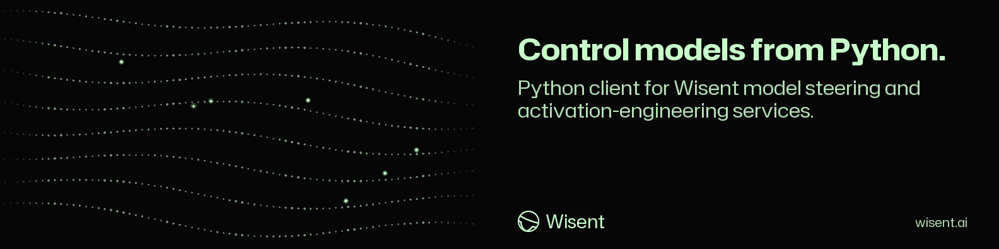

<!-- wisent-banner:start -->
<p align="center">
  
</p>
<!-- wisent-banner:end -->

<!-- wisent-readme-signals:start -->
[](https://github.com/wisent-ai/wisent-python) [](https://github.com/wisent-ai/wisent-python/issues) [](https://wisent.ai) [](https://discord.gg/qRjpkthq54) [](https://www.linkedin.com/company/wisent-ai/) [](https://x.com/wisentai) [](https://calendly.com/lbartoszcze)
<!-- wisent-readme-signals:end -->

# Wisent

Monitor and Control Your AI Agent Brain.

You look at what your model says. But what was it actually thinking? Wisent shows
you how to use information from AI activations, intermediate steps within its
layers, to your advantage. Wisent is a full toolkit for representation
engineering, activation steering and mechanistic interpretability. Cut
hallucination rates, decensor your model or stop it from being detected by
AI-generated text detectors. Your Models — Yours to Control. Better than
fine-tuning. Better than analysing the outputs directly.

Deploy the latest research in your stack. This is the Python client you call it
from.

## Installation

```bash
pip install wisent
```

Or install from source:

```bash
git clone https://github.com/wisent-ai/wisent.git
cd wisent
pip install -e .
```

## Features

- **Activations**: Extract and send model activations to the Wisent backend
- **Control Vectors**: Retrieve and apply control vectors for model inference
- **Inference**: Utilities for applying control vectors during inference
- **Utilities**: Helper functions for common tasks
- **First use**: A durable guided journey that completes only after a parsed authenticated inference result

## Quick Start

```python
from wisent import WisentClient

# Initialize the client
client = WisentClient(api_key="your_api_key", base_url="https://api.wisent.ai")

# Extract activations from a model and send to backend
activations = client.activations.extract(
    model_name="mistralai/Mistral-7B-Instruct-v0.1",
    prompt="Tell me about quantum computing",
    layers=[0, 12, 24]
)

# Get a control vector from the backend
control_vector = client.control_vector.get(
    name="helpful",
    model="mistralai/Mistral-7B-Instruct-v0.1"
)

# Apply a control vector during inference
response = client.inference.generate_with_control(
    model_name="mistralai/Mistral-7B-Instruct-v0.1",
    prompt="Tell me about quantum computing",
    control_vectors={"helpful": 0.8, "concise": 0.5}
)

# Print the response
print(response.text)
```

## First Use

The public client exposes the pinned `first-use` journey. Inspect the journey,
then use the normal authenticated `InferenceClient.generate` path:

```python
from wisent import WisentClient

client = WisentClient(api_key="your_api_key")
session = client.first_use.start()
client.first_use.inspect(session["attempt"]["attempt_id"])

result = client.inference.generate(
    model_name="mistralai/Mistral-7B-Instruct-v0.1",
    prompt="Tell me about quantum computing",
)
state = client.first_use.state(session["attempt"]["attempt_id"])
assert state["attempt"]["evidence"]["api_result_observed"] is True
```

Creating the client, configuring authentication, dispatching a request, or
receiving an API/response-validation error does not complete first use.
Progress and the canonical event outbox are stored atomically at
`~/.wisent/onboarding-state.json`; set `WISENT_ONBOARDING_STATE_PATH` to choose
another location. When `STADO_ONBOARDING_TOKEN` is configured, the adapter uses
Stado `bundle.read`, `experiments.assign`, `events.collect`, and `state.read`;
the exact pinned bundle and local durable queue remain available offline.

## Advanced Usage

### Extracting Activations

```python
from wisent.activations import ActivationExtractor

# Create an extractor
extractor = ActivationExtractor(
    model_name="mistralai/Mistral-7B-Instruct-v0.1",
    device="cuda"
)

# Extract activations for a specific prompt
activations = extractor.extract(
    prompt="Tell me about quantum computing",
    layers=[0, 12, 24],
    tokens_to_extract=[-10, -1]  # Extract last 10 tokens and final token
)

# Send activations to the Wisent backend
from wisent import WisentClient
client = WisentClient(api_key="your_api_key")
client.activations.upload(activations)
```

### Working with Control Vectors

```python
from wisent.control_vector import ControlVectorManager

# Initialize the manager
manager = ControlVectorManager(api_key="your_api_key")

# Get a control vector
helpful_vector = manager.get("helpful", model="mistralai/Mistral-7B-Instruct-v0.1")

# Combine multiple vectors
combined_vector = manager.combine(
    vectors={
        "helpful": 0.8,
        "concise": 0.5
    },
    model="mistralai/Mistral-7B-Instruct-v0.1"
)

# Apply during inference
from wisent.inference import Inferencer
inferencer = Inferencer(model_name="mistralai/Mistral-7B-Instruct-v0.1")
response = inferencer.generate(
    prompt="Tell me about quantum computing",
    control_vector=combined_vector,
    method="caa"  # Context-Aware Addition
)
```

### Batch Processing

```python
# Extract activations for multiple prompts
prompts = [
    "Explain quantum computing",
    "What is machine learning?",
    "Tell me about neural networks"
]

results = []
for prompt in prompts:
    activations = extractor.extract(prompt=prompt, layers=[0, 12, 24])
    results.append(activations)

# Batch upload
client.activations.upload_batch(results)
```

## Supported Models

Wisent currently supports the following models:
- Mistral models (mistralai/Mistral-7B-Instruct-v0.1, mistralai/Mixtral-8x7B-Instruct-v0.1)
- Llama 2 models (meta-llama/Llama-2-7b-chat-hf, meta-llama/Llama-2-13b-chat-hf)
- Claude models (via API integration)
- GPT models (via API integration)

## Requirements

- Python 3.8 or higher
- PyTorch 2.0 or higher
- transformers 4.30.0 or higher

## Compatibility

The library has been tested on:
- Linux (Ubuntu 20.04+)
- macOS (11.0+)
- Windows 10/11

## Contributing

We welcome contributions to Wisent! To contribute:

1. Fork the repository
2. Create a new branch (`git checkout -b feature/amazing-feature`)
3. Make your changes
4. Run tests (`pytest tests/`)
5. Commit your changes (`git commit -m 'Add some amazing feature'`)
6. Push to the branch (`git push origin feature/amazing-feature`)
7. Open a Pull Request

## Documentation

For full documentation, visit [docs.wisent.ai](https://docs.wisent.ai).

## Support

For support, please:
- Check the [documentation](https://docs.wisent.ai)
- Open an issue on GitHub
- Contact us at support@wisent.ai

## License

MIT